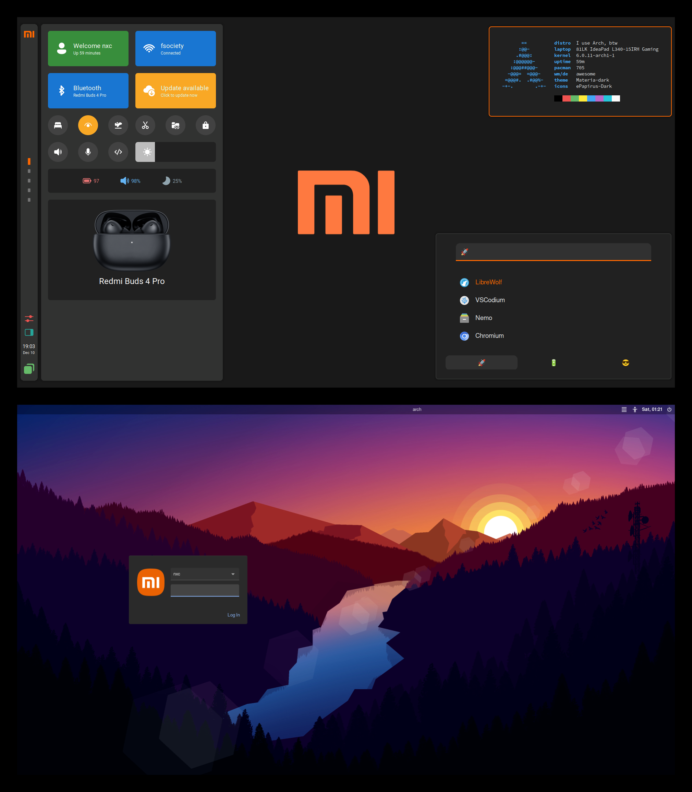

# MIUI rice

### AwesomeWM


# Catppuccin rice

### AwesomeWM


### Qtile


# Setup - Arch

## 1. Install window manager

   ```shell
   # Awesome
   yay -S awesome-git

   # Qtile
   yay -S qtile-git
   ```

## 2. Install softwares

   ```shell

   yay -S lxappearance lxsession rofi nemo brightnessctl playerctl alsa-utils papirus-icon-theme ttf-roboto noto-fonts-emoji network-manager-applet pasystray redshift

   yay -S picom-jonaburg-git lain-git cava cbonsai

   # Catppuccin GTK themes
   yay -S catppuccin-gtk-theme-mocha catppuccin-gtk-theme-macchiato catppuccin-gtk-theme-frappe catppuccin-gtk-theme-latte

   # LightDM
   yay -S lightdm lightdm-gtk-greeter xorg-xwd
   sudo systemctl enable lightdm.service
   ```

## 3. Themes

   - [Papirus - Icon theme](https://github.com/PapirusDevelopmentTeam/papirus-icon-theme)
   - [Materia - Gtk theme](https://github.com/nana-4/materia-theme)
   - [Catppuccin - Gtk theme](https://github.com/catppuccin/catppuccin)

   To switch between MIUI and Catppuccin awesome rice go to ./awesome/config/variables.lua,
   update global_theme value and restart awesome

## 4. MIUI Dashboard

### 4.1. Top 4 sections ( Left to right )

   - 1. Dispaly user name and uptime
   - 2. Toggle WiFi
   - 3. Toggle Bluetooth
   - 4. Run pacman -Syyu if updates available

### 4.2. 9 action buttons ( Left to right )

   - Bedtime mode ( greyscale and disable notifications )
   - Reading mode ( reduce blue light with redshift )
   - Airplane mode ( disable notifications and turn off WiFi and Bluetooth )
   - Screenshot ( flameshot gui )
   - Symlink ( runs sh ~/dotfiles/symlink.sh )
   - Locks screen ( i3lock-fancy )
   - Mute default sink ( pactl )
   - Mute default source ( pactl )
   - Default Arch action

### 4.3. Bluetooth earbuds

Available devices for now:

List will most likely update in the future,
These just show the image, bluetooth will still work

    - Redmi Buds 4 Pro
    - Redmi Buds 4
    - Redmi Buds 3 Pro
    - Redmi Buds 3 Lite

    - Xiaomi Buds 4 Pro
    - Xiaomi Buds 3T Pro
    - Xiaomi Buds 3
    - Xiaomi FlipBuds Pro


<!-- To enable battery percentage display

```shell
    # Go to
    /etc/bluetooth/main.conf

    # Set experimental value
    Experimental = true

    # Restart bluetooth
    systemctl restart bluetooth

    # Reconnect device and run
    bluetoothctl info

    # Now you should be able to see
    Device XX:XX:XX:XX:XX:XX
    Name: Redmi Buds 4 Pro
    Alias: Redmi Buds 4 Pro
    ...
    Battery Percentage: 0x3c (60)
``` -->